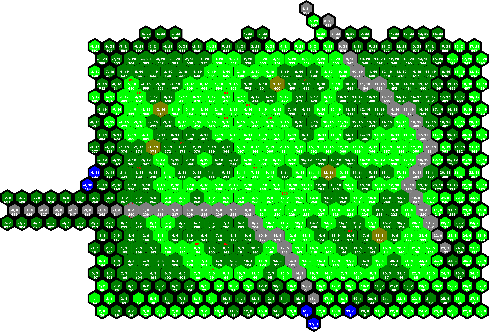

The results of my work to reverse-engineer the map files used by [Möbius Front '83](http://www.zachtronics.com/mobius-front/).

* The `docs` folder contains [`Mobius-Front-83-Map-Format.md`](docs/Mobius-Front-83-Map-Format.md), which describes the map format.
* The `scripts` folder contains [`MapReader.py`](scripts/MapReader.py), a Python script that reads the game's map files and renders images of each map that include the coordinates of each hex, the location and type of file-defined units, and other information.

