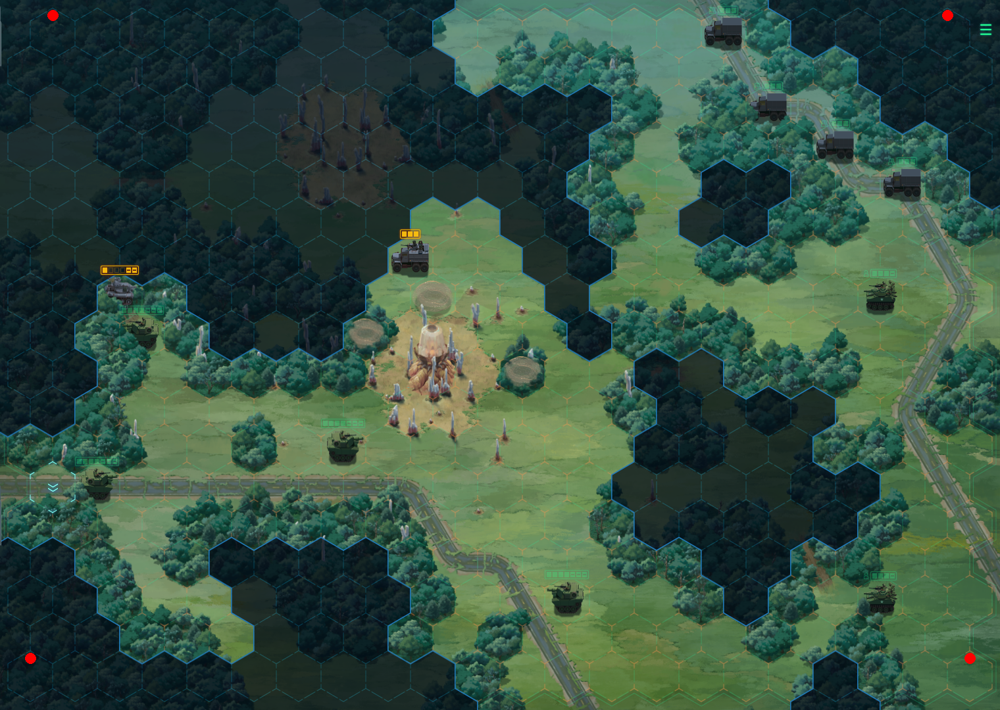
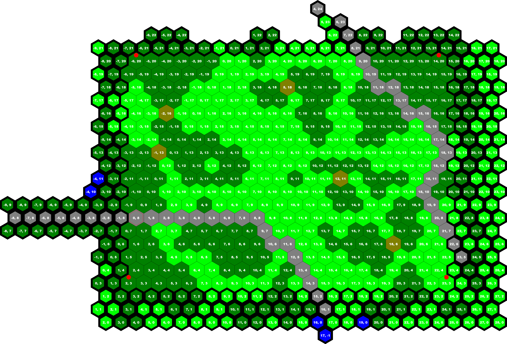

# Möbius Front '83 Map Format

This document describes the format of the map files used by the 2020 Zachtronics game [Möbius Front '83](http://www.zachtronics.com/mobius-front/). The information in this document was obtained by reverse engineering and is not official.

Please note that this document contains mild spoilers.

# Miscellaneous Notes

* The word "hex" is used as an abbreviation of "hexagon", not "hexadecimal", unless otherwise stated.
* Coordinates in this document are specified as (column, row).
* All values are in decimal unless preceded by "0x", which denotes a hexadecimal number.

# Location of Map Files

The game's map files are located in `Content\maps` within the Möbius Front '83 directory. Under Windows 10, the full path to this folder is `C:/Program Files (x86)/Steam/steamapps/common/Möbius Front '83/Content/maps` (assuming a default Steam installation).

Möbius Front '83 loads map files on startup and modifications to these files are reflected in-game. Before modifying any files, be sure to make backup copies. Files can also be restored to their original state in Steam by right-clicking on the name of the game and selecting *Properties > Local Files > Verify Integrity of Game Files*.

# Notes on Map Structure

* In-game, the play area consists of 18 rows of hexes. The bottom row contains 22 hexes and the quantity per row alternates between 21 and 22 thereafter for a total of 387 hexes accessible to units.
* Hexes outside the play area are partially visible.
* Most map files include a substantial number of hexes outside the play area, including many that aren't visible in-game; the total number of hexes varies from map to map.
* Row index increases from bottom to top.
* Column index increases from left to right.
* Column indices shift as row index increases: the column index corresponding to a given x position decreases.
  * For example, the column index of the leftmost hex within the play area in a given row equals (4 - ceil(rowIndex/2)).
  * This is an [axial coordinate system](https://www.redblobgames.com/grids/hexagons/#coordinates-axial), a common choice for hex-based grids.
* The corners of the play area are located at the following coordinates:
  * Bottom-left: (2, 3)
  * Bottom-right: (23, 3) 
  * Top-left: (-6, 20)
  * Top-right: (14, 20)

## Example

This screenshot shows map `c332.map` (chapter 3, mission 8) as it appears in-game when running at a resolution of 1920x1080 (the corners of the play area are marked with red dots to aid comparison with the next image):

This image depicts the full contents of `c332.map` (hexes outside the play area are rendered with a thicker outline):

# File Sections

Sections are listed in the order they appear in the file.

## Format Version

Offset | Type | Length | Description
---|---|---|---
0 | Int | 4 | File format version

In the maps included with the game, this value is always 6 or 9. The latter is more common: all the campaign maps except `c231.map` use the version 9 format, and `c231.map` appears to be unused (there are 15 `c2*.map` files but only 14 missions in chapter 2).

The format version affects the data included after the hexes. This document describes version 9; for reference, the post-hex sections of version 6 are listed at the end of this document.

## Number of Hexes

Offset | Type | Length | Description
---|---|---|---
4 | Int | 4 | Number of hexes in the map file (Nhexes)

Since each hex is described using five bytes (see below), this allows one to calculate the offset of the first byte following the hex data (8 + 5*Nhexes).

## Hex

Quantity: Nhexes

Hexes start at offset 8. Each hex has an entry of the following format (these offsets are relative to the start of each entry):

Offset | Type | Length | Description
---|---|---|---
0 | Int | 2 | Column index
2 | Int | 2 | Row index
3 | Int | 1 | Terrain type (see below)

Hexes are often specified in order from bottom to top, left to right, but not always. Within a row, left-to-right order seems to be consistently maintained, but rows may appear out of order.

### Terrain Types
Value | Type
---|---
0 | Grass
1 | Forest
2 | Water emitting red gas
3 | Road
4 | Water
5 | Bare ground
6 | Path through forest
7 | Gate generator (has a tooltip like a unit)

## Unknown

Offset | Type | Length | Description
---|---|---|---
8 + 5*Nhexes | Int | 4 | Unknown

Usually 0. Set to 1 for some campaign maps (files starting with `c`). Set to 2 for tutorial maps (files starting with `t`).

## Number of Control Points

Offset | Type | Length | Description
---|---|---|---
Varies | Int | 4 | Number of control points (Npoints)

## Control Point

Quantity: Npoints

Offsets are relative to the start of the entry.

Offset | Type | Length | Description
---|---|---|---
0 | Int | 2 | Column index
2 | Int | 2 | Row index

## Number of Allied Units

Offset | Type | Length | Description
---|---|---|---
Varies | Int | 4 | Number of allied units (Nallied)

## Allied Unit

Quantity: Nallied

Offsets are relative to the start of the entry.

Offset | Type | Length | Description
---|---|---|---
0 | Int | 2 | Column index
2 | Int | 2 | Row index
3 | Int | 1 | Unit type

## Number of Enemy Units

Offset | Type | Length | Description
---|---|---|---
Varies | Int | 4 | Number of enemy units (Nenemy)

## Enemy Unit

Quantity: Nenemy

Offsets are relative to the start of the entry.

Offset | Type | Length | Description
---|---|---|---
0 | Int | 2 | Column index
2 | Int | 2 | Row index
3 | Int | 1 | Unit type

# Unit Types

Note that some units are repeated. Some repetitions have different equipment, but others are apparently identical (perhaps with differences not visible to the player).

Value | Unit
---|---
0x00 | Game crashes when starting level.
0x01 | RIFLE TEAM
0x02 | M151 1/4-ton utility truck
0x03 | M151 1/4-ton utility truck
0x04 | RECON TEAM
0x05 | ANTI-ARMOR TEAM
0x06 | AIR-DEFENSE TEAM
0x07 | MORTAR TEAM
0x08 | M48 PATTON main battle tank
0x09 | M60 PATTON main battle tank
0x0A | M1 ABRAMS main battle tank
0x0B | M551 SHERIDAN airborne assault vehicle
0x0C | M3 BRADLEY cavalry fighting vehicle
0x0D | M151 1/4-ton utility truck
0x0E | M113 armored personnel carrier
0x0F | M113 ACAV armored cavalry vehicle
0x10 | M113 armored personnel carrier (with Dragon ATGM)
0x11 | M113 TOW anti-tank missile vehicle
0x12 | M901 ITV improved TOW vehicle
0x13 | M106 mortar carrier
0x14 | MACHINE GUN TEAM
0x15 | M577 command post vehicle
0x16 | M2 BRADLEY infantry fighting vehicle
0x17 | M151 1/4-ton utility truck (MG)
0x18 | M151 1/4-ton utility truck (TOW ATGM)
0x19 | M813 5-ton cargo truck
0x1A | M198 towed howitzer
0x1B | M109 self-propelled howitzer
0x1C | M151 1/4-ton utility truck (HMG)
0x1D | M167 VADS air-defense system
0x1E | M163 VADS air-defense vehicle
0x1F | M48 CHAPARRAL air-defense vehicle
0x20 | OH-6 CAYUSE observation helicopter
0x21 | UH-1 IROQUOIS utility helicopter (MG)
0x22 | CH-47 CHINOOK transport helicopter
0x23 | AH-1 COBRA attack helicopter
0x24 | M813 5-ton cargo truck
0x25 | INFANTRY TEAM (plywood; 4 HP)
0x26 | INFANTRY TEAM (plywood; 4 HP)
0x27 | M813 5-ton cargo truck
0x28 | M60 PATTON main battle tank
0x29 | CH-47 CHINOOK transport helicopter
0x2A | INFANTRY TEAM (plywood; 3 HP)
0x2B | M113 armored personnel carrier (HMG)
0x2C | UH-4 CHEYENNE utility helicopter (grey)
0x2D | T-72 main battle tank (plywood)
0x2E | UH-4 CHEYENNE utility helicopter (grey)
0x2F | BMP-1 infantry fighting vehicle (plywood)
0x30 | M822 5-ton cargo truck (grey)
0x31 | M822 5-ton cargo truck (grey)
0x32 | M822 5-ton cargo truck (grey)
0x33 | GAZ-66 light cargo truck (plywood)
0x34 | UH-4 CHEYENNE utility helicopter (grey; MG)
0x35 | M822 improvised gun truck (grey; HMG)
0x36 | M220 1/2-ton tactical truck (grey; HMG)
0x37 | UH-1 IROQUOIS utility helicopter (MG)
0x38 | M220 1/2-ton tactical truck (grey; MG and TIS-330)
0x39 | M291 assault gun vehicle (grey; this is the pesky six-wheeled vehicle that can fire both weapons after moving)
0x3A | RIFLE TEAM (grey)
0x3B | ANTI-ARMOR TEAM (grey)
0x3C | ASSAULT TEAM (grey)
0x3D | ANTI-ARMOR TEAM (grey; wearing protective suits)
0x3E | ANTI-TANK MISSILE TEAM (grey)
0x3F | LASER TEAM (grey)
0x40 | SIGNALS TEAM (grey; carries TIS-330; can't be moved)
0x41 | M60 PATTON main battle tank (grey)
0x42 | M60 PATTON main battle tank (grey; same as 0x41)
0x43 | M154 MICV infantry combat vehicle (grey)
0x44 | M113 armored personnel carrier (grey; HMG)
0x45 | M113 armored personnel carrier (grey; laser)
0x46 | M113 armored personnel carrier (grey; heat round)
0x47 | M822 5-ton cargo truck (grey)
0x48 | M822 improvised gun truck (grey)
0x49 | M822 5-ton cargo truck (grey; white flag on antenna)
0x4A | M220 1/2-ton tactical truck (grey; HMG)
0x4B | M220 1/2-ton tactical truck (grey; heat round)
0x4C | M220 1/2-ton tactical truck (grey; mortar)
0x4D | M220 1/2-ton tactical truck (grey; laser weapon)
0x4E | M294 ATGM anti-tank missile vehicle (grey; hatchet ATGM)
0x4F | M114 towed howitzer (grey)
0x50 | MORTAR TEAM (grey)
0x51 | M109 self-propelled howitzer (grey)
0x52 | M42 DUSTER air-defense vehicle (grey)
0x53 | M192 HAWK air-defense system (grey; SAM site)
0x54 | AN/MPQ-50 target acquisition radar (grey; SAM radar)
0x55 | M664 computer-controlled gun (grey)
0x56 | OH-31 KICHAI reconnaissance helicopter (grey)
0x57 | OH-31 KICHAI reconnaissance helicopter (grey)
0x58 | UH-4 CHEYENNE attack helicopter (grey)
0x59 | M822 5-ton cargo truck (grey; can't be moved)
0x5A | ISRO swarm
0x5B | UH-4 CHEYENNE utility helicopter (grey)
0x5C | ISRO cylinder (3 HP)
0x5D | ISRO structure (turns adjacent grass hexes to bare ground and creates three ISRO swarms on adjacent hexes)
0x5E | MILITARY OFFICER
0x5F | RESEARCH SCIENTISTS
0x60 | M220 1/2-ton tactical truck (grey)
0x61 | M113 armored personnel carrier (grey)
0x62 | DEMOLITION TEAM
0x63 | ISRO cylinder (4 HP)
0x64 | ISRO cylinder (5 HP)
0x65 | Base of destroyed ISRO structure (turns adjacent grass hexes to bare ground)
0x66 | M48 PATTON main battle tank (immobilized)
0x67 | M60 PATTON main battle tank (immobilized)
0x68 | M1 ABRAMS main battle tank (immobilized)
0x69 | M60 PATTON main battle tank (immobilized, grey)
0x6A | M154 MICV infantry combat vehicle (immobilized, grey)
0x6B | M60 PATTON main battle tank (entrenched, grey)
0x6C | M294 ATGM anti-tank missile vehicle (entrenched, grey)
0x6D | M113 armored personnel carrier (immobilized, grey)
0x6E | M42 DUSTER air-defense vehicle (immobilized, grey)
0x6F | UH-1 IROQUOIS utility helicopter (anti-tank mines)
0x70 | Game crashes when starting level.

# Post-Hex Data (File Format Version 6)

This information is uncertain. The game doesn't appear to use any of the version 6 files and I haven't tried replacing any version 9 files with them.

Section | Quantity | Length | Description
---|---|---|---
N1 | 1 | 4 | Appears to be the number of hexes within the play area (always 387 = 9 * 21 + 9 * 22)
? | N1 | 4 | Coordinates (column and row, two bytes each)
N2 | 1 | 4 | Number of control points
Control point | N2 | 4 | Coordinates of a control point
N3 | 1 | 4 | Number of ?
? | N3 | 4 | Coordinates
N4 | 1 | 4 | Number of units (perhaps a mix of allied and enemy?)
? | N4 | 5 | Coordinates plus one byte for unit type
N5 | 1 | 4 | Number of ?
? | N5 | 4 | Coordinates
N6 | 1 | 4 | Number of ? (always 0)
? | N6 | ? | ? (no examples in map files)